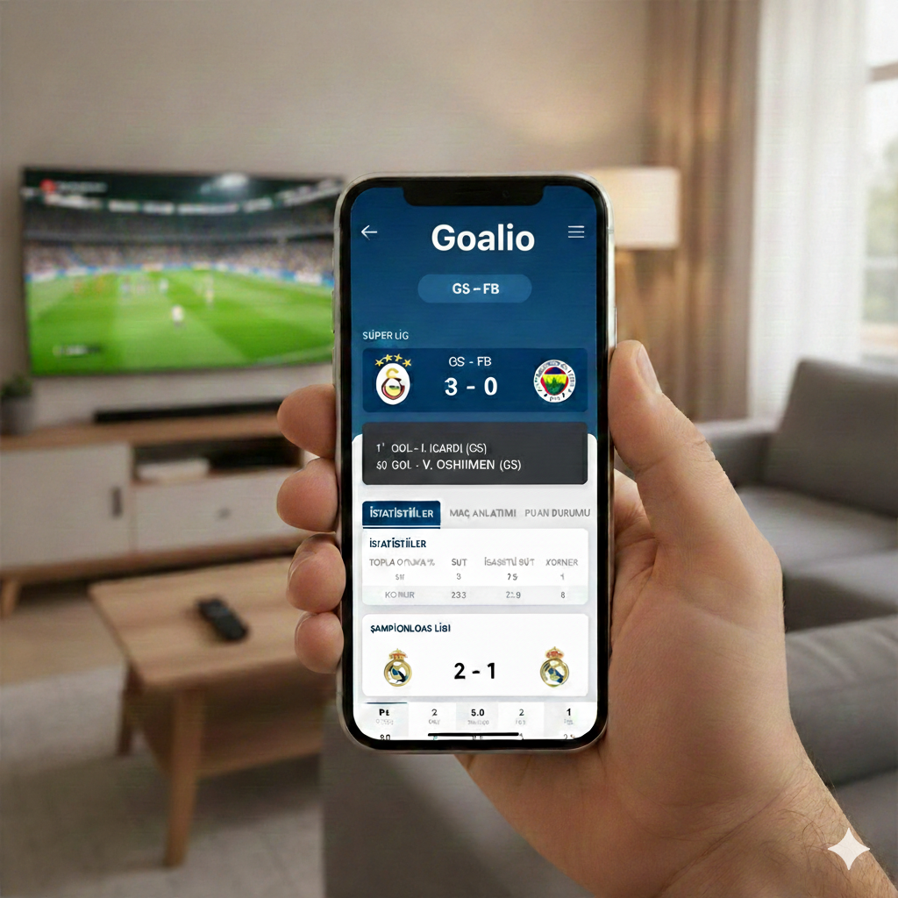

# Goalio

## Proje Hakkında


**Proje Tanımı:**
Goalio – Maç takip ve tahmin uygulaması

## Proje Amacı
Goalio: Yapay Zekâ Destekli Yeni Nesil Futbol Platformu
Goalio, futbol tutkunlarının maç heyecanını bir adım öteye taşıyan, kapsamlı ve akıllı bir canlı skor ve maç takip uygulamasıdır. Kullanıcılara geleneksel spor platformlarının sunduğu detaylı maç verilerini sağlarken, gücünü yapay zekâdan alan yenilikçi tahmin algoritmalarıyla fark yaratır.

Platformun sunduğu temel değerler şunlardır:

Dinamik Maç ve Lig Takibi: Tıpkı alıştığınız büyük spor uygulamaları gibi, dünya genelindeki ligleri, canlı maç skorlarını, maç öncesi detayları ve maç sonu istatistiklerini anlık olarak sunar. Kullanıcılar lig bazlı filtrelemeler yapabilir ve geçmiş maçların detaylı verilerine kolayca ulaşabilir.

Kişiselleştirilmiş Futbol Deneyimi: Her kullanıcı kendi profilini oluşturarak desteklediği veya yakından takip etmek istediği favori takımları seçebilir. Bu sayede platform, kullanıcının ilgilendiği maçları ve bildirim tercihlerini önceliklendirerek özel bir ana sayfa akışı yaratır.

Yapay Zekâ ile Akıllı Tahminler (AI-Powered Insights): Goalio'yu standart canlı skor uygulamalarından ayıran en büyük özellik, entegre yapay zekâ motorudur. Sistem, maçlar için veriye dayalı otomatik tahminler üretir ve bu tahminlerin "Güven Oranını" (Confidence Rate) kullanıcılarla paylaşır.

Kullanıcı ve Yapay Zekâ Etkileşimi: Kullanıcılar sadece AI tahminlerini okumakla kalmaz, kendi futbol bilgilerini konuşturarak maçlar için kendi tahminlerini de sisteme kaydedebilirler. Hem kullanıcıların hem de yapay zekânın tahmin geçmişi, başarı oranları ve istatistikleri platform üzerinde şeffaf bir şekilde listelenir.

Kısacası Goalio; canlı skor takibi, takım aidiyeti ve veri bilimi tabanlı tahmin dinamiklerini tek bir şık arayüzde birleştiren interaktif bir futbol ekosistemidir.
 

**Proje Kategorisi:** 
- Mobil Uygulama

**Grup Adı:**
- EMOTİON

**Ekip Üyeleri:** 
- Emircan Bartan
- Murat Koçgürbüz
- Onur Eken

**Referans Uygulama:** 
> [Maçkolik](https://www.mackolik.com/canli-sonuclar)

## Proje Linkleri
- **REST API Adresi:**


## Klasör Yapısı
1. [Gereksinim Analizi](Gereksinim-Analizi.md)
2. [REST API Tasarımı](API-Tasarimi.md)
3. [REST API](Rest-API.md)
4. [Mobil Front-End](MobilFrontEnd.md)
5. [Mobil Backend](MobilBackEnd.md)
6. [Video Sunum](Sunum.md)

### Kendi Reponuzu Oluşturma ve Şablonu Ekleme
**Adım 1: Bu Şablon Repoyu Klonlama**
1. Bu (Goalio şablon) repoyu yerel bilgisayarınıza klonlayın:
```bash
git clone https://github.com/emirbrtn/Goalio.git
```
**Adım 2: Kendi Reponuza Ekleme**
1. Kendi reponuzu da git clone ile çekerek Goalio şablonunu içine ekleyin.
2. Böylece şablon projenin tüm içeriği kendi reponuza kopyalanmış olur.